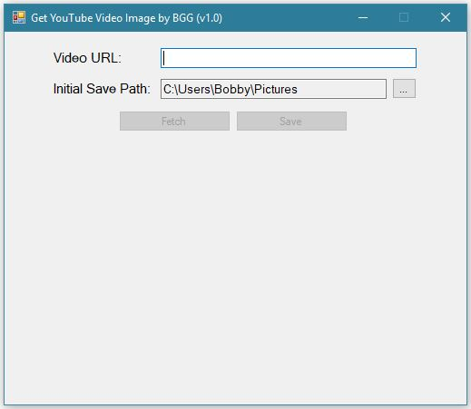

# Get YouTube Video Image

This repo includes some of my practice with Visual Basic. It contains a simple utility that grabs the thumbnail associated with a YouTube video and allows the user to download it.

## Screenshot

